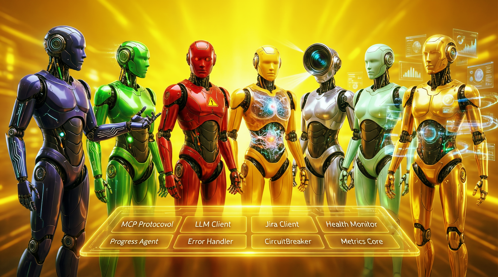
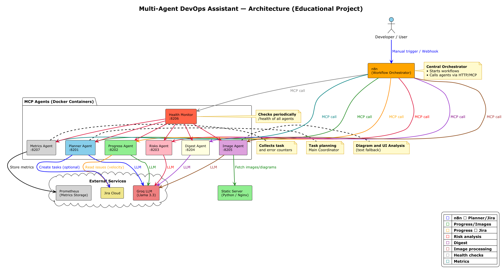
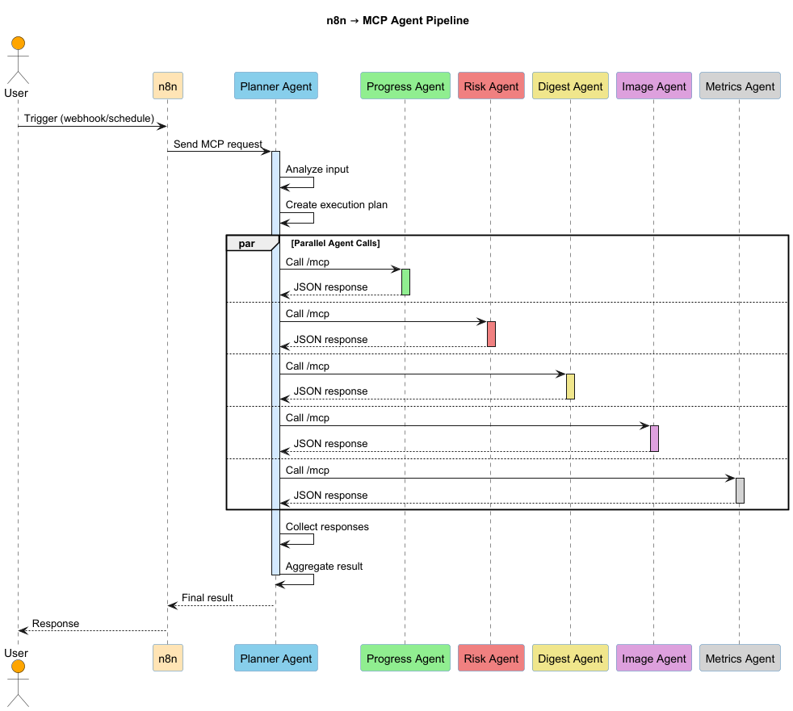
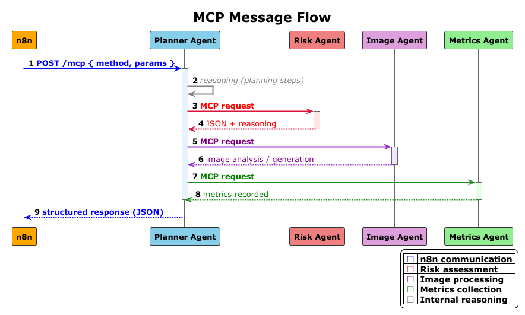

= Multi-Agent DevOps Assistant
:toc: macro
:toc-placement: manual
:toc-title: Содержание
:toclevels: 3
:icons: font
:sectanchors:
:sectlinks:

toc::[]

---

image:https://img.shields.io/badge/License-MIT-yellow.svg[License: MIT, link=https://opensource.org/licenses/MIT]
image:https://img.shields.io/badge/python-3.12-blue.svg[Python 3.12, link=https://www.python.org/downloads/]
image:https://img.shields.io/badge/FastAPI-framework-green.svg[FastAPI, link=https://fastapi.tiangolo.com/]
image:https://img.shields.io/badge/docker-required-blue.svg[Docker, link=https://www.docker.com/]
image:https://img.shields.io/badge/Jira-tracking-blue.svg[Jira, link=https://www.atlassian.com/software/jira]
image:https://img.shields.io/badge/OpenRouter-API-orange.svg[OpenRouter, link=https://openrouter.ai/]
image:https://img.shields.io/badge/Groq-AI-red.svg[Groq, link=https://groq.com/]
image:https://img.shields.io/badge/n8n-automation-orange.svg[n8n, link=https://n8n.io/]

---
== 1. Общая идея проекта

Система реализует мультиагентную архитектуру, в которой:

* каждый агент является отдельным сервисом;
* взаимодействие осуществляется через MCP-протокол;
* оркестрация выполняется с помощью n8n;
* поддерживается масштабирование и отказоустойчивость;
* используется LLM для анализа, генерации и reasoning;
* присутствует мультимодальный агент (работа с изображениями).

---

=== 2.1 Общая архитектурная схема

Диаграмма отражает:
- роль n8n как оркестратора;
- набор MCP-агентов;
- взаимодействие с LLM-провайдерами;
- вспомогательные сервисы (метрики, health-check, static server).

---

=== 2.2 Пайплайн обработки запросов (n8n → агенты)

Пайплайн демонстрирует последовательность вызовов агентов,
инициируемых workflow в n8n.

---

=== 2.3 MCP-взаимодействие между агентами

Каждый агент обрабатывает MCP-запрос и возвращает структурированный JSON-ответ
с результатами и шагами reasoning.
---

== 3. Архитектура агентов

Все агенты реализованы как независимые сервисы:

* FastAPI
* отдельный Docker-контейнер
* endpoint `/health`
* endpoint `/mcp`
* структурированное логирование
* единый формат сообщений

---

=== 3.1 Planner Agent

**Назначение:**
- принимает запрос от n8n;
- планирует выполнение;
- распределяет задачи между агентами;
- агрегирует результаты.

**Функции:**
- координация пайплайна;
- вызов других MCP-агентов;
- формирование итогового ответа.

---

=== 3.2 Progress Agent

**Назначение:**
- анализ прогресса и последовательности действий;
- вычисление метрик выполнения;
- подготовка аналитических выводов.

Используется для демонстрации обработки данных и аналитики.

---

=== 3.3 Risk Agent

**Назначение:**
- выявление потенциальных рисков;
- анализ проблем и уязвимостей;
- формирование рекомендаций.

Работает на основе LLM.

---

=== 3.4 Digest Agent

**Назначение:**
- агрегация информации от других агентов;
- генерация итогового текстового отчёта;
- подготовка сводки для пользователя.

---

=== 3.5 Image Agent (мультимодальный)

**Назначение:**
- анализ изображений и схем;
- генерация описаний;
- работа с визуальными артефактами.

Поддерживает:
- передачу URL изображения;
- взаимодействие с LLM (OpenRouter);
- fallback-режим при ошибках.

---

=== 3.6 Metrics Agent

**Назначение:**
- сбор и учёт метрик обработки;
- подсчёт количества запросов;
- подготовка данных для мониторинга.

---

=== 3.7 Health Monitor

**Назначение:**
- проверка доступности агентов;
- health-check эндпоинты;
- основа для наблюдаемости системы.

---

== 4. MCP-протокол взаимодействия

Все агенты принимают запросы в формате:

[source,json]
----
{
  "method": "tools/<method_name>",
  "params": { ... }
}
----

И возвращают структурированный ответ:

[source,json]
----
{
  "result": "...",
  "reasoning": [
    {
      "step_number": 1,
      "description": "Описание шага",
      "input_data": {},
      "output_data": {}
    }
  ]
}
----

Такой формат обеспечивает:
- прозрачность работы;
- трассируемость решений;
- удобство отладки.

---

== 5. Развёртывание

=== 5.1 Требования

* Docker
* Docker Compose
* Linux / WSL / macOS
* установленный PlantUML-плагин (для документации)

---

=== 5.2 Запуск системы

[source,bash]
----
docker compose up --build
----

После запуска становятся доступны:

* n8n — http://localhost:5678
* агенты — порты 8201–8207
* health-check — `/health`

---

== 6. Переменные окружения

Все секреты хранятся в `.env` и не коммитятся в репозиторий.

Пример:

[source,env]
----
LLM_PROVIDER=groq
GROQ_API_KEY=xxxx

VISION_PROVIDER=openrouter
OPENROUTER_API_KEY=XXXXXXXXXXXXX
VISION_MODEL=

JIRA_URL=https://
JIRA_API_TOKEN=XXXXXXXXXXX
JIRA_PROJECT_KEY=PROJ

LOG_LEVEL=INFO
PYTHONUNBUFFERED=1
----

---

== 7. Наблюдаемость и устойчивость

* каждый агент имеет `/health`;
* ошибки логируются;
* сбой одного агента не останавливает систему;
* n8n может повторять вызовы;
* метрики собираются через Metrics Agent.

---

== 8. Масштабируемость

Архитектура поддерживает:

* добавление новых агентов без изменения ядра;
* горизонтальное масштабирование контейнеров;
* замену LLM-провайдера;
* расширение MCP-методов.

---

== 9. Итог

[options="header"]
|===
| Проект демонстрирует:

| ✅ многоагентную архитектуру
| ✅ MCP-взаимодействие
| ✅ мультимодальность
| ✅ n8n orchestration
| ✅ масштабируемость
| ✅ устойчивость
| ✅ документированность
|===

Система может служить основой для DevOps-помощника или обучающего прототипа мультиагентных систем.